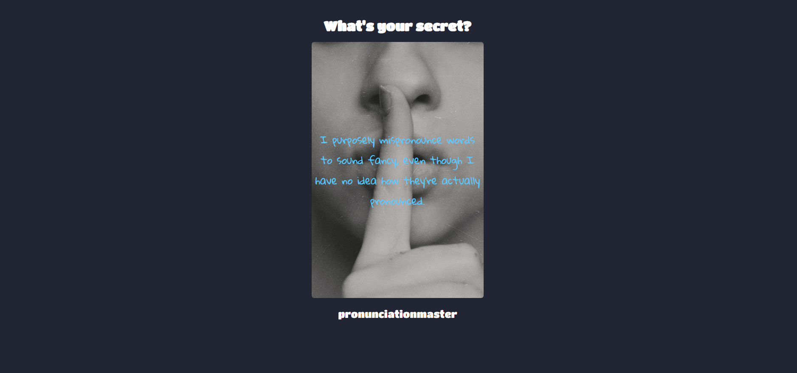

# Lisper app


## Screenshots




## Run Locally

Install dependencies

```bash
  npm install
```

Start the server

```bash
  node index.js
```


## Lessons Learned

in this project i review the usage of the Axios and the express and using the API 

https://secrets-api.appbrewery.com/

