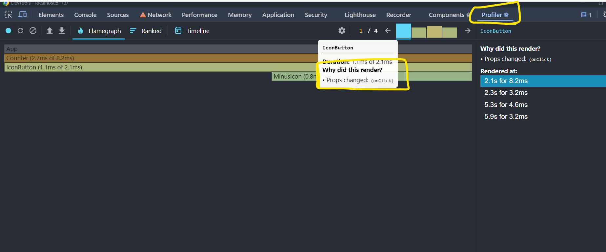

# how React works 
## Show component tree and React dev tool -> Profiler Flame Graph

The React Profiler Flame Graph helps visualize the performance of your React application. It shows a graphical representation of the component tree, highlighting which components are rendering and how long each render takes. This allows developers to identify performance bottlenecks and optimize their React components for better performance.
* we can see why a component rendered by activating ` Record why each component rendered while profiling` in react dev tool setting


## memo function (Avoid component executions)
The memo function in React is a higher-order component (HOC) that optimizes functional components by preventing unnecessary re-renders. It works by memoizing the component—meaning it will only re-render if its props change.

### why Use memo ?
When a parent component re-renders, all its child components also re-render by default, even if their props haven’t changed. This can lead to performance issues, especially in large applications. React.memo helps by caching the rendered output and only updating the component when necessary.

### using memo 
1. import it 
```jsx
import {memo} from 'react';
```
2. wrap this function around the component function.
```jsx
export default memo(function Counter({ initialCount }) {
    // Codes
  }
);

```
### what memo do ?
* take a look at the props of your component function and whenever the component function would normally execute again for example because the parent component executes memo take a look at the old prop value `initialCount`
1. if the previous value and new value are the same (for object and array should be exactly the same thing in memory) the function reExecution will be preventing by memo 
2. if the previous value and new value are not the same the component reExecuted.

### don't overuse memo :
* cause if we use memo to wrap all the components React have to check all of the props  
* checking props with memo() costs performance!.
*  don't use it on components where props will change frequently

### using memo with object or function prop 
* because every time the app reRendered the function and object will be changed so we have to use useCallback for these situations 

## useMemo hook 
memo prevent the component function to reRender unless the props changed but useMemo used for functions inside of the component function unless their inputs changes 
### usage 
1. import 
```jsx
import {useMemo } from 'react';
```
2. using on functions 
```jsx
// it reExecuted if the initialCount changed
const initialCountIsPrime = useMemo(()=>isPrime(initialCount),[initialCount]);
```

* `IMPORTANT` don't use useMemo on simple functions because using useMemo costs performance each time that executed